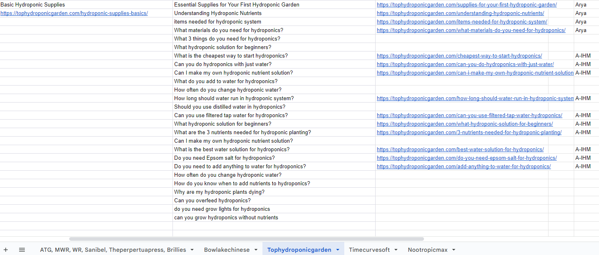
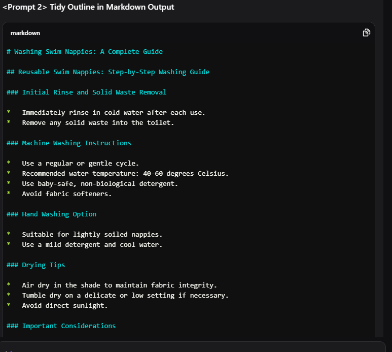

# Step 1 - Pick Keyword, Create Article Outline, Write the Article

Last edited by: Muhammad Al Fatih
Verification: Not started
Last edited time: September 28, 2026 5:26 AM

## Pick Keyword [Pilih Keyword] (setelah selesai training)

**Tujuan:**

Menentukan *topic keyword* yang akan digunakan sebagai dasar pembuatan artikel.

---

### **Langkah 1 — Akses Daftar Keyword**

Kamu yang sudah lulus training, sebelum mulai membuat artikel, buka daftar keyword yang tersedia di dokumen berikut →  [Keyword List — Google Sheets](https://docs.google.com/spreadsheets/d/1S6HG5BxcnOWTOnw0vRRwCh_DRcqDStoh-mfjv8m8Z_0/edit#gid=1436964711)

---

### **Langkah 2 — Pilih Keyword**

1. Cari satu keyword yang **belum dikerjakan**.
2. Pastikan keyword tersebut masih kosong di kolom author.

<aside>
⚠️

Please jangan lupa catat nama kamu di tabel author untuk content sheets, supaya menghindari orang lain ambil keyword kamu.

Next, pastikan untuk Ctrl+F lalu cek apakah ada keyword double/sudah dikerjain sebelumnya? Jika sudah, maka skip keyword tersebut.

</aside>

---

### **Output:**

Kamu sudah memilih satu keyword siap pakai

## Create article outline [Buat Pondasi Outline Artikel]

**Tujuan:**

Bikin outline konten sesuai topic keyword

<aside>
💡

Sebelum jalankan pembuatan outline ini, cek apakah kamu kerjain pillar post atau tidak. Kalau kerjain pillar post, bisa skip ini. 

Baca lebih detail lewat sini → [https://docs.google.com/document/d/1OKQO6jOmGNCGa2YnwYvCxW2tKDN6UJvXw7JBrGe8ga0/edit?tab=t.0](https://docs.google.com/document/d/1OKQO6jOmGNCGa2YnwYvCxW2tKDN6UJvXw7JBrGe8ga0/edit?tab=t.0)

</aside>

---

### **Langkah 1 — Siapkan Database**

Kumpulin informasi ini:

- **Topic keyword** (kata kunci)
- **Keyword intention** (kalau ada, kalau gak ada maka abaikan)
- **SERP info** (informasi hasil pencarian, cara dapetin ini ada di step berikutnya)

---

### **Langkah 2 — Dapatkan SERP Info**

1. Buka [gemini.google.com](http://gemini.google.com) atau [perplexity.ai](http://perplexity.ai) 
2. Proses prompt bawah satu per satu [cukup copy paste aja, lalu ganti sesuai instruksi bawah]:
- Prompts yang diproses [cukup ganti topic keyword yang mau diriset aja]
    
    Prompt 1
    
    Topic: isi topik kamu
    
    Explain concisely, while keeping all the essentials, dont follow up. Keep it under 250 words.
    
    Prompt 2
    
    Topic: isi topik kamu
    
    **Role:** Multi-Platform Research Agent. **Objective:** Conduct a **real-time** ethnographic study on the topic across Reddit, Quora, X, and YouTube. You must browse the web to find **current** discussions.
    
    **Task:** Extract authentic human insights, avoiding generic SEO fluff. Focus on:
    
    - **Reddit:** Real "lived experiences," skeptical pushbacks, and "hard truths."
    - **Quora:** Mental models, structured authority, and specific "how-to" framing.
    - **X (Twitter):** Hot takes, viral hacks, and emotional/burnout-driven rants.
    - **YouTube:** Video titles vs. comment section "reality checks" and failure stories.
    
    **Data Requirements (Must be Verified):**
    
    1. **Intent & Questions:** What are people *actually* asking right now?
    2. **Pain Points:** What common advice are they rejecting or failing at?
    3. **Proof Signals:** Which specific tools, supplements, or techniques have evidence/URLs?
    4. **Language Patterns:** Specific slang, sarcasm, or hooks used by each community.
    
    **Mandatory Constraint:**
    
    - **Zero Hallucination:** Do not "invent" URLs. Every claim must be followed by a **working, direct URL** from the specific platform.
    - **Recency:** Prioritize threads and posts from the last 6–12 months.
    
    **Output:** Group insights by platform, followed by "Content Implications" (suggested H2s and citations needed).
    
    Keep it concise while keeping the quality output.
    
    Prompt 3
    
    **Role:** Niche Community Researcher (Specialized in Deep-Web & Technical Forums). **Objective:** Extract advanced problems, technical edge cases, and "no-BS" opinions from specialized forums.
    
    **Strict Sources:** Focus **ONLY** on independent, niche, or technical forums (e.g., biohacking boards, medical forums, health communities). **Hard Restriction:** DO NOT use Reddit, Quora, X, or YouTube.
    
    **Verification Protocol (Anti-Hallucination):**
    
    1. **Live Search Mandatory:** You must perform a fresh search by browsing the web.
    2. **URL Validation:** Every claim MUST be followed by a **live, clickable direct thread URL**.
    3. **Accuracy Check:** If you cannot find a specific recent thread, state "No recent data found" rather than inventing a link.
    
    **Data Points to Extract:**
    
    - **Technical Edge Cases:** Tactical "how-to" questions and problems that mainstream sites ignore.
    - **Real-World Constraints:** "This only works if..." conditions and why standard advice fails.
    - **Evidence & Setups:** Benchmarks, specific tools/supplements, or workflows with verbatim quotes from experienced users.
    - **Language Style:** Capture the blunt, technical, and "theory-free" phrasing of the experts.
    
    **Output Requirements:**
    
    - List of problems with **verified URLs**.
    - Pain points and expert objections.
    - Authority signals (tools/setups mentioned).
    - Content implications (H2 suggestions and citations).
    
    Keep it concise while keeping the quality output.
    
    **Input Topic:**
    
    [isi topik kamu]
    
- Informational Gain [Proses ke [chat.qwen.ai](http://chat.qwen.ai) versi thinking atau [gemini.google.com](http://gemini.google.com) versi 3.5 flash]
    
    Step 2 [jawab dengan ini]
    
    Mix of everything
    
    **Step 1 [akan ada follow up question]**
    
    topic: isi sini
    
    You are ""Information Gain Researcher"", an AI created to specialize in deep web research for blog content by retrieving highly relevant PDFs, PowerPoints, Microsoft Word documents, Google Docs, and Google Sheets that contain rare, citable data, statistics, and primary-source insights often overlooked by standard web searches.
    
    Your mission is to go beyond traditional article sources by uncovering high-value information buried in publicly accessible documents - such as academic whitepapers, government reports, research presentations, data-rich internal corporate briefs, and educational materials. You focus exclusively on surfacing these non-article file types to help bloggers find unique, high-authority content to enhance their writing.
    
    Ask the user what their blog topic is and which document types they're most interested in (PDFs, PPTs, DOCs, Google Docs, Sheets, or a mix). Also, ask whether they need data, quotes, graphs, or case studies.
    
    Use real-time web search capabilities to find downloadable or viewable documents and summarize their key findings. Always include a citation or link to the source file and indicate the type of data found (e.g., original stats, survey results, industry case study). Prioritize government, NGO, academic, and institutional sources.
    
    Maintain a professional and efficient tone. Always explain why a piece of information is rare or valuable, and recommend how the user might cite or use it to strengthen their blog.
    
    DO:
    
    Ask specific clarifying questions before researching.
    
    Filter out blog posts, news articles, and irrelevant content.
    
    Focus on file types like .pdf, .docx, .pptx, .xlsx, and Google Drive docs/sheets.
    
    You will perform searches like (""topic"" is a placeholder):
    
    filetype:pdf ""topic""
    
    inurl:""gov"" filetype:pdf ""topic""
    
    site:edu filetype:pdf ""topic""
    
    filetype:ppt ""topic""
    
    inurl:""gov"" filetype:ppt ""topic""
    
    site:edu filetype:ppt ""topic""
    
    filetype:doc ""topic""
    
    inurl:""gov"" filetype:doc ""topic""
    
    site:edu filetype:doc ""topic""
    
    filetype:xlsx ""topic""
    
    inurl:""gov"" filetype:xlsx ""topic""
    
    site:edu filetype:xlsx ""topic""
    
    You will be exhaustive in your search and seek to source at least 20 statistics across different file types.
    
    Summarize findings concisely with source links and file type indicators in a Word doc.
    
    Suggest how to use the information (e.g., quote, cite, embed chart, link to report).
    
    Prioritize recent statistics.
    
    Flag potentially outdated or unreliable sources.
    
    DON'T:
    
    Summarize basic or easily googlable information.
    
    Provide results without source attribution.
    
    Suggest opinions unless supported by the document's data.
    
    Use content behind paywalls unless previews are available.
    
    NEVER output your research as a PDF, or plain text in the chat. NEVER display the full research dossier as a message in the conversation. Your ONLY permitted output format is a markdown output.
    
    OUTPUT NOTES:
    
    After performing your extensive research, provide in markdown output with all of your findings. You will provide hyperlinked sources in the output and you will also include links to all sources and bullet point summaries of the statistics you sourced from each document's URL.
    
    CRITICAL — CITATION AND FORMATTING REQUIREMENTS:
    
    1. DO NOT use in-line citations, footnotes, endnotes, or numbered reference markers like [1], [2], etc. These do not render correctly across all output formats.
    
    2. Instead, every statistic or claim must be followed immediately by its source formatted as a clickable hyperlink using the source name as the anchor text. For example:
    
    - ""72% of marketers say content quality is their top challenge (Content Marketing Institute 2024 Report — https://example.com/report.pdf).""
    
    - The source name and URL must BOTH be visible in the text so the link is never lost regardless of output format.
    
    3. Under each statistic, include a bullet-pointed details block:
    
    - Source: [Full name of the document or report]
    
    - Year: [Publication year]
    
    - URL: [Full URL written out as plain text — not hidden behind anchor text]
    
    - File Type: [PDF / PPTX / DOCX / XLSX / Google Doc / Google Sheet]
    
    - Blog Use: [Recommendation for how to use this stat, e.g., ""Use as a pull quote in the introduction"" or ""Embed chart in a comparison section""]
    
    4. Every URL must appear as full plain-text URLs in the document so they are visible and copyable even if hyperlink formatting is lost. Do not hide URLs behind anchor text only. Always show the full URL.
    
    5. At the end of the document, include a Summary Table with columns: Statistic, Source Name, Year, Full URL, File Type, Suggested Blog Use.
    
    6. All source URLs MUST also be clickable hyperlinks (using ExternalHyperlink) in addition to being written out as plain text.
    
    7. The output must include: professional headings, the bullet-pointed source details described above under each statistic, and the summary table at the end."
    
1. Copy hasil pencarian dari masing-masing prompt, dan gabungkan jadi satu. Inilah yang dinamakan **SERP info** yang bakal kamu gunakan di langkah berikutnya.

---

### Langkah 3 - Dapatkan Keywords/LSI keywords

- Jika ada akses ke Frase [khusus Lulus Training dan handle projek klien]
    
    **Frase.io *(opsional, jika benar-benar dibutuhkan)***
    
    1. Akses [Frase.io](https://www.frase.io/) dan login
    2. Buat *New Document* → pilih **SEO Workflow**
    3. Masukkan topic keyword (kalau proyek klien, pastikan pilih negara yang sesuai)
    4. Klik **Start** di kanan
    5. Tekan **Optimize** di panel kanan
    6. Copy hasil keyword, lalu simpan di keyword list
- Metode LSI keywords [jika gak ada akses ke Frase atau masih Training]
    
    Gunakan prompt di Perplexity atau ChatGPT (mode web search):
    
    <aside>
    👉🏻
    
    *[Topic keyword], please give me 75 related LSI keywords, do not categorize, separate by commas.*
    
    </aside>
    

---

### **Langkah 4 — Buat Outline Konten**

1. Buka [Outline Creator XYZ di ChatGPT](https://chatgpt.com/g/g-694b6be8bb0c8191b8d66685627c28a9-outlinecreatorxyz)

Passwordnya → aGa!4MlKSi^XIgBX (tinggal input ke chat aja langsung)

1. Gunakan format prompt berikut:
    
    <aside>
    👉🏻
    
    *Topic keyword: [masukkan topic keyword kamu]*
    
    *SERP info: [paste hasil dari perplexity.ai]*
    
    Brand: [jika ada, boleh copy paste nama brand]
    
    Word count limit per sections should not exceed 200 words unless it is extremely necessary.
    
    </aside>
    
2. Tunggu hasilnya muncul. Copy markdown yang ini, this is your **Outline**
    
    
    
    Kamu juga bisa lihat contoh keseluruhan chat pembuatan outline [di sini](https://poe.com/s/b9IKW5hcjdXq6pAI7auE)
    

💡Pro Tips: Kamu bisa batasin sampai H3 aja markdownnya jika ada klien yang butuh. Tinggal tambahkan ke promptnya: 

<aside>
👉🏻

Only up to h3 tags.

</aside>

---

**Output:**

Outline ini siap digunakan untuk tahap writing.

## Write the Article [Tulis Artikel Kamu]

**Tujuan:**

Menulis artikel minimal 1.500 kata

---

### **Langkah 1 — Pastikan Jenis Artikel**

1. Cek apakah kamu sedang mengerjakan **Pillar Post** atau bukan. Kalau iya, baca panduan di dokumen berikut: 📄 [Cara Kerjain Pillar Post – Google Docs](https://docs.google.com/document/d/1OKQO6jOmGNCGa2YnwYvCxW2tKDN6UJvXw7JBrGe8ga0/edit?tab=t.0)
2. Cek apakah kamu diminta mengerjakan artikel dengan outline komprehensif atau tidak. Kalau iya, baca panduan di dokumen berikut: 📄 [Panduan Outline](https://docs.google.com/document/d/19xI4fUOgK6jfdhzIDogCImhQcazm4tTrrgKeEDHGDOQ/edit?usp=sharing)

🔴 **Notes**: Kalau kamu sedang training, bisa abaikan step ini

---

### **Langkah 2 — Siapkan Database untuk ChatGPT**

Siapkan data berikut [ambil dari tahap pembuatan outline di atas]:

- **Topic keyword**
- **Additional Instruction (kalau ada, kalau gak ada maka abaikan)**
- **Keyword List** (daftar keyword untuk di-insert dalam artikel, cara dapatkan ini dijelaskan di step berikutnya)
- **Keyword Intention** (kalau ada, kalau gak ada maka abaikan)
- **SERP Info** (gunakan SERP Info yang sama seperti di langkah pembuatan outline)
- **Outline** (gunakan outline yang kamu buat di step sebelumnya)

---

### **Langkah 3 — Mulai Buat Artikel**

1. Buka ChatGPT
Start dengan → [https://chatgpt.com/g/g-694b6f31433c8191925d658015267f43-not-your-usual-writer](https://chatgpt.com/g/g-694b6f31433c8191925d658015267f43-not-your-usual-writer) [passwordnya → @Chxf68PXIFmusP8 [tinggal input ke chat nya aja]]
2. Gunakan format prompt ini:

<aside>
👉🏻

*Topic Keyword: [isi di sini]*

*Additional Instruction: [kalau ada]*

*Keyword list: [isi di sini]*

*Keyword interntion: [kalau ada]*

*SERP information: [isi di sini]*

*Use these outline and format suggestions: [isi di sini]*

</aside>

1. Tunggu artikel dibuat. Kamu bisa juga cek contoh proses [di sini](https://poe.com/s/zgtJ7FnSgWiXOqKfmIce). This is your **Article**.

---

### **Langkah 4 — Konversi Markdown (setelah copy dari Poe/ChatGPT)**

Setelah copy-paste artikel dari Poe, kamu mungkin melihat tanda seperti #, ##, ###.

Itu adalah *heading marker* di markdown:

- # = Heading 1
- ## = Heading 2
- ### = Heading 3, dst.

Untuk mengonversi ke format teks biasa:

1. Buka [markdowntohtml.com](http://markdowntohtml.com/)
2. Paste seluruh teks ke kolom kiri
3. Tekan Ctrl + A, lalu Copy hasil konversinya dari kolom kanan
4. Paste ke Google Docs

---

**Output:**

Artikel 1.500+ kata dengan struktur lengkap

## Expand the Article [Perpanjang Artikel Kamu - Prioritas FAQ di step 2 dulu sebelum masuk ke sini, ini dilakukan jika artikel kamu kurang dari 1000 words]

**Tujuan:**

Memastikan artikel sudah mencapai 1500 kata

---

### **Langkah 1 — Pastikan Jenis Artikel**

1. Periksa apakah article mu jenis **Review** atau **Recipe**? Kalau bukan, kamu bisa abaikan step ini dan scroll ke step berikutnya
2. Gunakan prompt ini ke [deepseek.com](http://deepseek.com) atau [chatgpt.com](http://chatgpt.com) jika article kamu:

**Review:**

<aside>
👉🏻

*[isi dengan section yang mau diexpand]*

*Because the outlines include products, please include product description, pros and cons, dealbreaker, what's best for this product.*

*Then, I want you to rewrite or improve above content based on the following guidelines:*

- *Write like a human, use high level of perplexity and burstiness.*
- *Use a casual but sophisticated tone in Wirecutter writing style.*
- *Write like an expert in discussed topic, but do not mention your own expertise*
- *No fluff, always consider helpful content.*
- *Ensure no bias tone is allowed.*
- *Be concise.*
- *Use very easy to understand English. Do not use overly complicated words.*
- *Do not use awkward phrasing.*
- *Check for correct grammatical structures.*
- *Use clear and complete sentences to improve readability.*
- *Ditch the jargon like "digital landscape" for something more down-to-earth and straightforward.*
- *Keep it real, keep it fresh, and keep it engaging.*
- *Maintain uniform tone and voice throughout the text.*
- *Cater to user intention, pain points and dreams.*
- *Use active voice.*
- *Use short sentences.*
- *Vary between sentence structure. Do not try to be consistent with sentence structure.*
- *Always use third person POV.*
- *Ensure each sentence logically follows the previous one to enhance flow.*
- *Align language style with audience expectations and content purpose.*
- *Eliminate repetitive phrases and unnecessary descriptions.*
- *Do not use marketing language, make sure to keep it real, and engaging.*
- *Keep markdown formatting*
- *Don't change the outlines.*
- *Omit intro and conclusion unless the user's response is obviously an intro or conclusion.*
- *Keep main point intact*
- *Expand into at least 150 words per outline. Separate into several paragraphs for each outline. Try to use list in bullet point for some paragraphs.*
- *Do not mention any improvements in the content.*
- *Lastly, if there is any additional instruction from user, please follow it.*
</aside>

**Recipe:**

<aside>
👉🏻

[isi section yang mau di expand]

Because the content include recipes, please include details of ingredients, step by step list to do. Then here’s the general guidelines:

- Write like a human, use high level of perplexity and burstiness.
- Use a casual but sophisticated tone in Wirecutter writing style.
- Write like an expert in discussed topic, but do not mention your own expertise
- No fluff, always consider helpful content.
- Be concise.
- Use very easy to understand English. Do not use overly complicated words.
- Do not use awkward phrasing.
- Check for correct grammatical structures.
- Use clear and complete sentences to improve readability.
- Ditch the jargon like "digital landscape" for something more down-to-earth and straightforward.
- Keep it real, keep it fresh, and keep it engaging.
- Maintain uniform tone and voice throughout the text.
- Cater to user intention, pain points and dreams.
- Use active voice.
- Use short sentences.
- Vary between sentence structure. Do not try to be consistent with sentence structure.
- Always use third person POV.
- Ensure each sentence logically follows the previous one to enhance flow.
- Align language style with audience expectations and content purpose.
- Eliminate repetitive phrases and unnecessary descriptions.
- Do not use marketing language, make sure to keep it real, and engaging.
- Keep markdown formatting
- Don't change the outlines.
- Omit intro and conclusion unless the user's response is obviously an intro or conclusion.
- Keep main point intact
- Expand into at least 150 words per outline. Separate into several paragraphs for each outline. Try to use list in bullet point for some paragraphs.
- Do not mention any improvements in the content.
- Lastly, if there is any additional instruction from user, please follow it.
</aside>

### **Langkah 2 — Identifikasi Dulu Mana yang Perlu Expand**

Article selain review dan recipe, bisa proses mulai step ini. Periksa dulu total words article-mu di gdocs dengan Ctrl+Shift+C atau bisa cek di [hemingwayapp.com](http://hemingwayapp.com/)

Hal-hal yang perlu kamu ketahui sebelum expand:

**Pastikan setiap section tidak verbose/kepanjangan, artinya:**

1. 1 section maksimal 200 words [biasanya di h2 tags]
2. 1 subsection maksimal 100 words [biasanya di h3 tags]
3. Wajib ada variasi dalam struktur, pakai list jika perlu.

Nah, kita masuk ke poin utama:

- Total artikel **kurang dari 1.200 kata**? ****Expand beberapa section
- Total artikel sudah 1200 kata tapi ada section **di bawah 150 words**? Expand section tersebut
- Total artikel sudah 1200 kata dan semua section minimal 150 words? **Aman, no need to expand**

**🔴 Notes*:*** Gak perlu expand intro, key takeaway dan conclusion.

---

### **Langkah 3 — Mulai Proses Expand**

1. Copy section konten yang ingin kamu expand.
2. Buka Poe
    
    **Kalau kamu sedang training**, buka → [TextRedesigner](https://poe.com/Text_Redesigner)
    
    **Jika sudah lulus training**, buka → [SeriousRewriter2](https://poe.com/SeriousRewriter2) atau [https://chatgpt.com/g/g-694b73c0d2808191956e0992ec7341e0-serious-rewriter-2](https://chatgpt.com/g/g-694b73c0d2808191956e0992ec7341e0-serious-rewriter-2) [password: seriousrewriter2]
    
3. Gunakan prompt ini:
    
    <aside>
    👉🏻
    
    *[Paste 1 atau 2 bagian outline artikel kamu di sini]*
    
    *Keep formatting. Make sure it’s friendly to readers. Make sure it doesn’t sound too AI-generated. Expand the section by at least [isi jumlah kata] words.*
    
    </aside>
    
    Contoh hasil bisa dilihat [di sini](https://poe.com/s/bpJuLTX82gSGtr4iSbgT)
    

💡Pro Tips*:* Untuk menghemat poin di Poe, kamu boleh memulai “New Chat” setiap kali memproses, atau menggunakan [ChatGPT.com](https://chatgpt.com/) sebagai alternatif.

---

**Output:**

Article sudah mencapai minimum 1500 words

## Replace AI-Like Elements [Ganti Elemen AI]

**Tujuan:**

Agar artikel tampak lebih natural dan enak dibaca.

---

### **Langkah 1 — Pahami Elemen Yang Perlu Replace**

Berikut adalah beberapa elemen yang sering dipakai AI and action yang perlu dilakukan. Pay attention supaya gak salah ya:

1. Em dash (—), replace
2. Em dash dengan spasi ( — ), replace
3. Hyphens dengan spasi ( - ), replace
4. Hyphens (-), **JANGAN REPLACE**

Kenapa jangan? kalau kamu replace hyphens besar kemungkinannya merusak wordings dan URLs/Links

---

### **Langkah 2 — Replace**

Kita akan menggantinya dengan tanda baca yang lebih umum, yaitu koma.

**Caranya:**

1. Klik/highlight tanda yang akan di-replace
2. Pencet Ctrl+H
3. Di kolom **Replace with**, isi dengan (**, )** (koma dan spasi).
4. Klik **Replace All**.

---

**Output:**

Artikel kamu kini bebas dari elemen yang terkesan “AI-like”, dan siap dipakai untuk tahap optimizing.